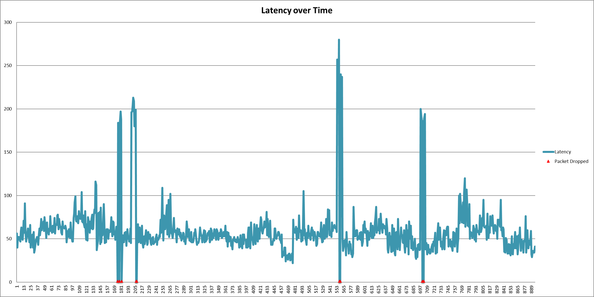

# basic-ping-logger
Logs ping data to an excel file with a chart for plotting latency/packet drop issues.

# Installation & Usage

`git clone https://github.com/crocokyle/basic-ping-logger.git`

`cd basic-ping-logger`

`pip install -r requirements.txt`

`python main.py`

> Excel files are created with the filename format timestamp `ping_data_{start_time}.xlsx` in the `basic-ping-logger` directory.
